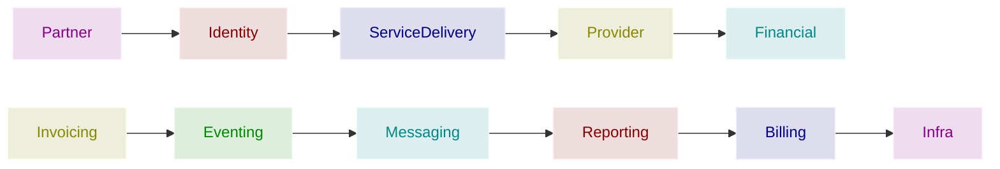

# Modelagem de Domínios

Este documento orienta a evolução incremental do projeto Otaku, separando responsabilidades em domínios claros para preservar consistência, segurança e facilitar entregas por etapas.

## Domains
Domínios e subdomínios agrupam problemas que o negócio resolve. A implementação incremental segue a sequência abaixo:

